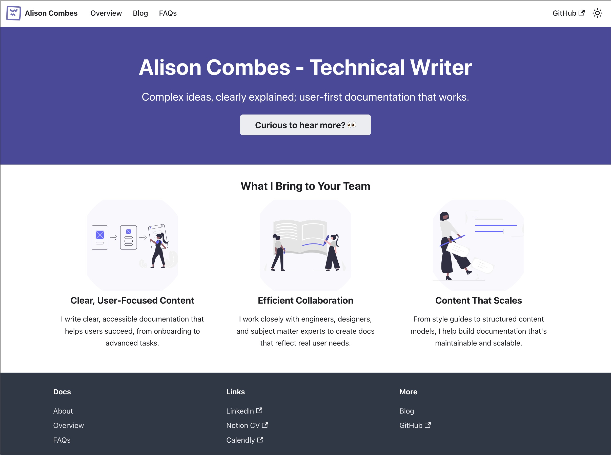

# Docusaurus Portfolio

- **Project:** Technical Writing Portfolio
- **Type:** Personal Project
- **Tools:** Docusaurus, React, CSS Modules

## Overview  
A live portfolio site that also serves as a working example of my documentation approach.   It's built on the same principles I bring to every writing project: **clarity**, **user-first navigation**, and **scalable content design**.

## Key Features  
- **Custom FAQ**, built with React, searchable and filterable by category  
- **Accessible UI**, built on Docusaurus with UX improvements  
- **Homepage messaging**, designed to balance clarity with tone of voice
- **Expandable roadmap**, to show planned improvements
- **Portfolio section**, starting with this project and built to scale

## What I Did  
- Wrote and edited all content using AI-assisted drafts  
- Planned information architecture for the site  
- Built custom React components (FAQ, filters, interactions)  
- Iterated on UX and structure throughout development

## Impact  
A practical demonstration of how I apply clarity, structure, and usability to documentation: starting with my own.

## Screenshot
